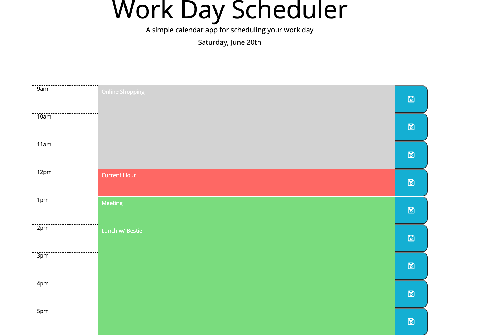

# Work Day Scheduler Starter Code
A planner for your everyday business needs!

## Table of contents
* [General info](#general-info)
* [Screenshots](#screenshots)
* [URL](#url)
* [Code](#code)
* [Status](#status)
* [Inspiration](#inspiration)
* [Contact](#contact)

## General info
The purpose of the project is to create a daily planner that helps to schedule your work day. 

## Screenshot

## URL
[Work Day Scheduler](https://achigas.github.io/work-day-scheduler-chal5/)

## Code
* HTML
* CSS
* Javascript
    * Jquery

## Status
Project is complete. 

## Inspiration
Alex Chigas. Project inspired by UCLAx Challenge 5.

## Contact
Created by Alex Chigas